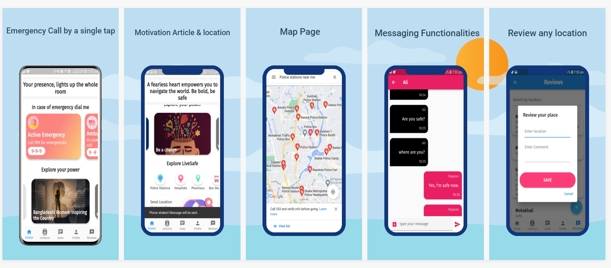

# 🚨 SafeConnect- Your Companion for Personal Safety 🚨

Welcome to **SafeConnect**, a robust and intuitive personal safety app developed using the Flutter framework. SafeConnect is designed to be a reliable companion during crises and emergencies, connecting users in distress with trusted contacts and essential support services. 🚑

---

## 🌟 Key Features

### 📞 Emergency Contacts
- Essential contact numbers for emergencies (ambulance, fire brigade, police) and call-by single-tap options.
- Option to add **trusted contacts** who will be notified in an emergency.

### 💬 Chat with Guardian
- Stay connected with **designated guardians** through an in-app chat.
- Guardians can initiate conversations to check on users' safety and well-being.

### 📍 Location-Based Services & Map
- Leverages **real-time location data** to provide tailored support and services.
- Interactive map displays markers for nearby help requests and resources like **police stations, hospitals, pharmacies,** and **bus stations**.

### 🚨 Panic Button
- An emergency button that alerts trusted contacts with **real-time location** sharing upon activation, prioritizing user safety.

### 📳 Shake Feature
- **Shake your phone** to automatically send a distress signal with your location to emergency contacts.

### 📘 Safety Guides & Motivational Articles
- Access practical **safety tips** and motivational content to empower and prepare users.

### 💪 Motivational Quotes
- A collection of **uplifting quotes** to inspire confidence and courage during challenging times.

### 🕵️ Anonymous Reporting & User Reviews
- Report incidents or unsafe locations **anonymously**.
- Provide feedback on guardian and rescuer experiences, promoting community responsibility.

---

## 💻 Tech Stack

SafeConnect leverages a modern and robust tech stack to deliver a seamless, reliable, and user-friendly experience. Here are the key technologies used:

| Technology       | Description |
|------------------|-------------|
|  | **Flutter** powers SafeConnect’s UI, allowing for a high-quality, cross-platform mobile experience. |
|  | **Dart** is the programming language behind Flutter, known for its fast performance and rich features. |
|  | **Firebase** provides SafeConnect’s backend, including **authentication**, **real-time database** functionality, and **cloud messaging**. |
|  | **Google Maps API** supports real-time location tracking and mapping services, a critical feature for SafeConnect’s emergency assistance. |

---

### Why This Stack?

Each component was selected to ensure that SafeConnect offers:

- **Cross-Platform Compatibility**: Flutter and Dart allow us to deploy SafeConnect on both Android and iOS with a consistent look and feel.
- **Scalability**: Firebase’s backend services make scaling easy, handling everything from user data to push notifications efficiently.
- **Real-Time Location Tracking**: Google Maps API enables precise location tracking, helping users access nearby resources when needed most.

By combining these technologies, SafeConnect aims to be a reliable safety tool for people in need, connecting them with immediate support in times of crisis.

---

## 💡 Why SafeConnect?

SafeConnect empowers individuals and communities to act decisively in emergencies. By combining real-time location tracking, swift communication, and guidance, we aim to promote a safer, more connected world. Join us and be part of a network dedicated to **personal safety, motivation, and positive impact.**

    

---

> **Stay connected. Stay safe.** With SafeConnect, support is just a click away. 🚑❤️

---

